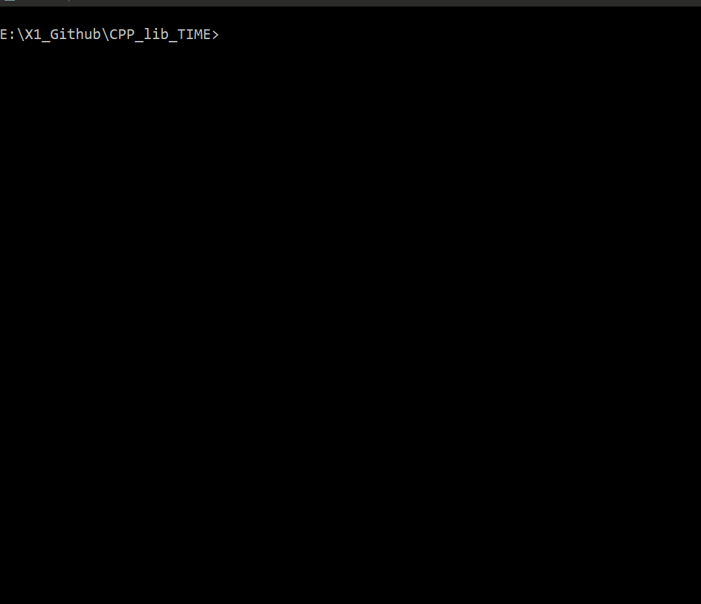

<!-- PROJECT LOGO -->
 

    
  </a>

<h3 align="center">CPP TIME LIBRARY  </h3>

    
  </a>

<!-- TABLE OF CONTENTS -->
## Project Info
## Project Structure
## Project Details
### Built With
## Tests
### Acceptance Level - Main Algorithm Test
### Acceptance Level - Code Test
## Links
<!-- MARKDOWN LINKS & IMAGES -->
<!-- https://www.markdownguide.org/basic-syntax/#reference-style-links -->
